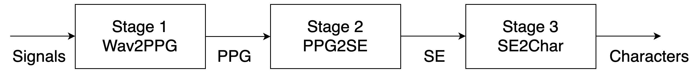

# Three Stage ASR
## Flow of three stage ASR

## wav2ppg
- 必須移到kaldi的環境下才可運行，其中re_punctuate.sh裡的punctuate_inference必須另外從MIRLAB的github下載 
- 產生包含標點符號之文本、PPG以及word_with_frame_num.json
## PPG2SE
- 從kaldi產生之PPG(phone_post.*.ark)轉成每個以音檔id為檔名之pkl檔(ex: PTSND20011107-00112_456-00135_785.pkl)，存放在data裏
    ```
    python save_phone_post.py --ppg_path ~/kaldi/egs/matbn/s0/exp/chain/cnn_tdnnf_sp_1b/phone_post/
    ```
- 產生文本之embedding，需要下列檔案，而因為有重新組句，所以產生出來之embedding檔名為"id.start.end.pkl"
    - word_with_frame_num.json
        - 包含從kaldi之CTM產生之token時間點，計算出之frame範圍
        - ex: {"start": 1069, "end": 1074, "word": "登"}代表音檔之第1069到1073個frame為"登"
        - 若word為單一token要加--use_single_chinese_word_for_json，ex: {"start": 10, "end": 20, "word": "觀"}{"start": 20, "end": 30, "word": "眾"}，若不是，ex:{"start": 10, "end": 30, "word": "觀眾"}則不用加
    - text
        - 包含音檔id和其包含標點符號之文本
    ```
    python save_sent_embedding.py --text ../data/train/text --word_with_frame_num_path ../data/train/word_with_frame_num.json --type train (--use_single_chinese_word_for_json)
    ```
- 產生噪音資料
    - 根據kaldi之CTM找出"<eps>"的時間點，並將它轉換為frame之範圍，並存成eps_ids.json
    - ex: {"start": 0, "end": 10, "word": "<eps>"}
- 產生各個子集之embedding的id集合之pkl，若要加入噪音資料，則一起把噪音之id加入embedding_pkls.pkl
    - ./embedding_pkl/* (optional:噪音id) -> embedding_pkls.pkl
- 訓練 PPG2SE 模型，nproc_per_node代表DDP使用之GPU數量
    ```
    python -m torch.distributed.launch --nproc_per_node 2 ddp_train_schedule.py --model_path model_path
    ```
- 使用scheduled sampling訓練 PPG2SE 模型
    ```
    python -m torch.distributed.launch --nproc_per_node 2 ddp_train_schedule.py --model_path model_path --schedule
    ```
-  固定第二階段，微調第三階段，要去程式碼裡面設定第二（PPG2SE_PATH）和三（SE2CHAE_PATH）階段的模型路徑
    - 根據第三階段模型決定是否要加'--bilstm'
    - 根據第二階段模型訓練時有無使用scheduled sampling來決定是否要加'--schedule'
    ```
    python -m torch.distributed.launch --nproc_per_node 2 ddp_fine_tune_stage3_fixed_stage2.py --model_path model_path --bilstm --schedule
    ```
- 測試
    - 要去程式碼裡面設定第二（PPG2SE_PATH）和三（SE2CHAE_PATH）階段的模型路徑
    - test_folder為存放PPG的路徑
    - 會產生decode出來的結果(test_out)，格式為'ID 解碼結果'
    ```
    python decode.py --result_path result_path --test_folder test_folder
    ```

## SE2Char
- 訓練SE2Char模型 - 三層FC 
    ```
    python train.py --model_path model_path/ --train_path train.txt --dev_path dev.txt
    ```
- 訓練SE2Char模型 - 兩層bi-GRU + 一層FC
    ```
    python train.py --model_path model_path --train_path train.txt --dev_path dev.txt --bilstm
    ```
- Mask 訓練 
    - 利用lexicon產生lexicon_word_pair.pkl和word_lexicon_pair.pkl
    ```
    python preprocess_lexicon_pair.py
    ```
    - 15% of the time, masking 
        - 50% of the time, replace with random word
        - 50% of the time, replace with homophone word which is in BERT vacab 
    ```
    python train.py --model_path model_path --train_path train.txt --dev_path dev.txt --mask
    ```
- 測試
    ```
    python eval.py --model_path model_state/ckpt.30.pt --text_path test.txt
    ```
## 計算MER
- 利用wav2ppg裡的scoring_mer.sh，英文以word為單位，中文以character為單位
```
./scoring_mer.sh --out test_out --ref test_ref --result_file result
```